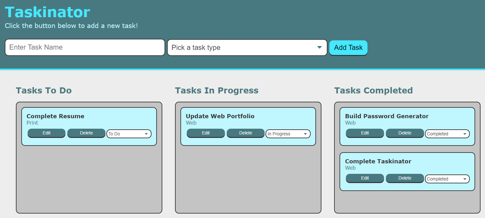

# TASKINATOR

## 1. Description
Taskinator is an application that helps the user keep track of multiple custom tasks they are in the middle of completing. This application was built using HTML, CSS, and JavaScript. 

DEPLOYMENT: [DIRECT LINK](https://cbushehry.github.io/taskinator/) | [GITHUB REPOSITORY](https://github.com/cbushehry/taskinator)

## 2. Features
 * Add custom tasks to 'Tasks To Do' list
 * Move custom tasks to 'Tasks in Progress' or 'Tasks Completed' when finished
 * Rearrange order of tasks / type of tasks
 * Save tasks to localStorage
 * Retrieve tasks from localStorage so you dont lose your progress.
 
 

## 3. Tech Stack
 * HTML
 * CSS
 * JavaScript

## 4. Credits / Contact
This application was created by Cameron Bushehry

  
  
